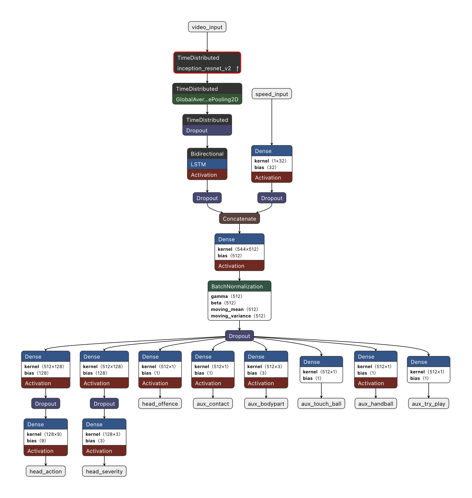
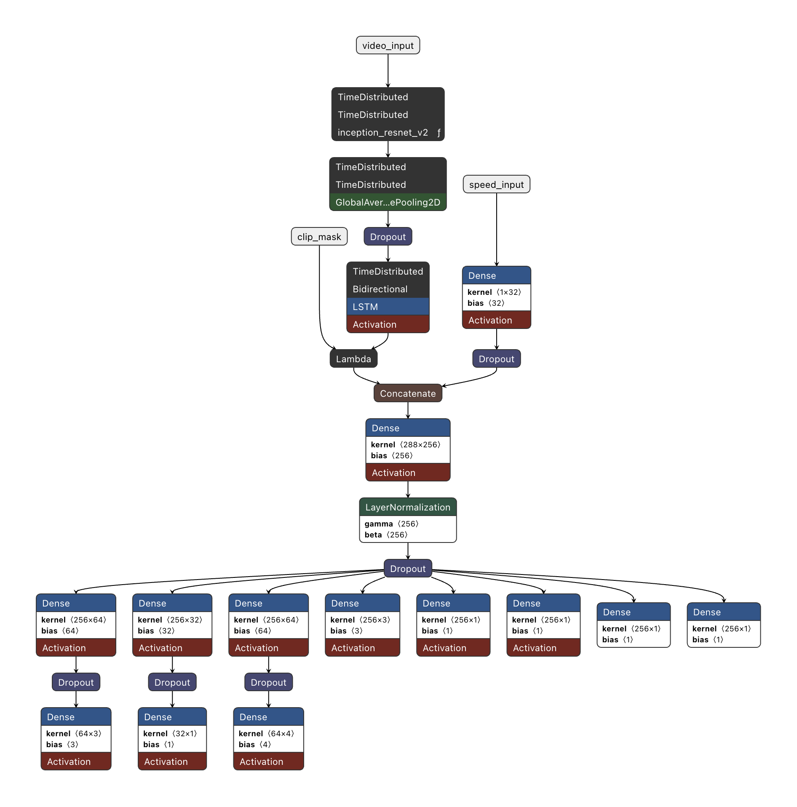
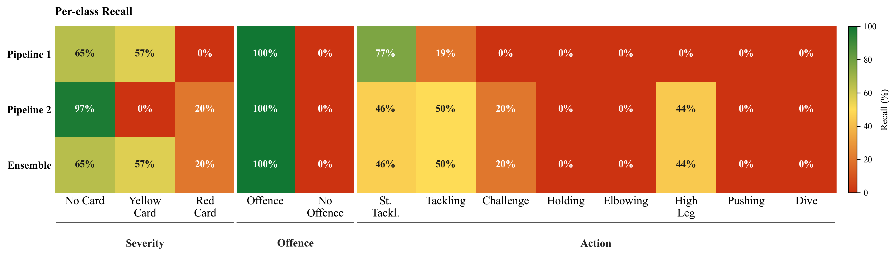

<div align="center">
    
    <a href="LICENSE">
    
    </a>
</div> 

<br>

We introduce **ArbItro**, a *deep learning framework* designed to support the recognition 
and classification of complex *football actions*. Unlike traditional systems that
treat foul detection as a simple binary problem, ArbItro employs a **_multitask learning_** approach 
to simultaneously interpret the *type of offence*, the *nature of the action*, and,
**crucially**, the **_severity_** of the **_disciplinary sanction required_**.

<div align="center">
  <h5>
    📄 <a href="asset/ArbItro.pdf" target="_blank">Paper - ArbItro: A Multi-View Framework for Football Foul
Recognition and VAR Decision Support </a>
  </h5>
</div>

##
<br>

## 📁 *Index*

- [Architecture](#architecture)
  - [Pipelines](#Pipelines)
  - [Software Stack](#software-stack)
- [Dataset](#dataset)
- [Result](#result)
- [Installation & Setup](#installation--setup)
  - [Training & Evaluation](#training--evaluation)
  - [App Installation](#app-installation)
- [Demo & Usage](#demo--usage)
- [Project Structure](#project-structure)
- [License](#license)

##
<br>

## *Architecture*

### *Pipelines*

<div align="center">
  <table>
    <tr>
      <td align="center"><b>Single View Pipeline</b></td>
      <td align="center"><b>Multi-view Pipeline</b></td>
    </tr>
    <tr>
      <td align="center"></td>
      <td align="center"></td>
    </tr>
  </table>
</div>

<br>

<details>
<summary><b> View Detailed Model Architecture & Parameters (56.1M Params)</b></summary>

<br>

**Model Statistics:**

* **Total parameters:** 56,159,663
* **Trainable:** 32,622,191
* **Non-trainable:** 23,537,472

| Layer (type) | Output Shape | Param # | Connected to |
| :--- | :--- | :--- | :--- |
| `video_input` (InputLayer) | `(None, 4, 16, 224, 398, 3)` | 0 | - |
| `td_cnn_clips` (TimeDistributed) | `(None, 4, 16, 5, 11, 1536)` | 54,336,736 | `video_input[0][0]` |
| `td_gap_clips` (TimeDistributed) | `(None, 4, 16, 1536)` | 0 | `td_cnn_clips[0][0]` |
| `dropout_video` (Dropout) | `(None, 4, 16, 1536)` | 0 | `td_gap_clips[0][0]` |
| `speed_input` (InputLayer) | `(None, 1)` | 0 | - |
| `td_lstm_per_clip` (TimeDistributed)| `(None, 4, 256)` | 1,704,960 | `dropout_video[0][0]` |
| `clip_mask` (InputLayer) | `(None, 4)` | 0 | - |
| `speed_embed` (Dense) | `(None, 32)` | 64 | `speed_input[0][0]` |
| `clip_fusion` (Lambda) | `(None, 256)` | 0 | `td_lstm_per_clip[0][0]`, `clip_mask[0][0]` |
| `dropout_speed` (Dropout) | `(None, 32)` | 0 | `speed_embed[0][0]` |
| `fusion` (Concatenate) | `(None, 288)` | 0 | `clip_fusion[0][0]`, `dropout_speed[0][0]` |
| `dense_shared` (Dense) | `(None, 256)` | 73,984 | `fusion[0][0]` |
| `ln_shared` (LayerNormalization) | `(None, 256)` | 512 | `dense_shared[0][0]` |
| `dropout_shared` (Dropout) | `(None, 256)` | 0 | `ln_shared[0][0]` |
| `act_dense` (Dense) | `(None, 64)` | 16,448 | `dropout_shared[0][0]` |
| `off_dense` (Dense) | `(None, 32)` | 8,224 | `dropout_shared[0][0]` |
| `sev_dense` (Dense) | `(None, 64)` | 16,448 | `dropout_shared[0][0]` |
| `act_dropout` (Dropout) | `(None, 64)` | 0 | `act_dense[0][0]` |
| `off_dropout` (Dropout) | `(None, 32)` | 0 | `off_dense[0][0]` |
| `sev_dropout` (Dropout) | `(None, 64)` | 0 | `sev_dense[0][0]` |
| `aux_bodypart` (Dense) | `(None, 3)` | 771 | `dropout_shared[0][0]` |
| `aux_contact` (Dense) | `(None, 1)` | 257 | `dropout_shared[0][0]` |
| `aux_handball` (Dense) | `(None, 1)` | 257 | `dropout_shared[0][0]` |
| `aux_touch_ball` (Dense) | `(None, 1)` | 257 | `dropout_shared[0][0]` |
| `aux_try_play` (Dense) | `(None, 1)` | 257 | `dropout_shared[0][0]` |
| **`head_action`** (Dense) | `(None, 4)` | 260 | `act_dropout[0][0]` |
| **`head_offence`** (Dense) | `(None, 1)` | 33 | `off_dropout[0][0]` |
| **`head_severity`** (Dense) | `(None, 3)` | 195 | `sev_dropout[0][0]` |

</details>

<br>

### *Software Stack*

#### ML & Deep Learning

<p align="left">
  &nbsp;&nbsp;&nbsp;
  &nbsp;&nbsp;&nbsp;
  &nbsp;&nbsp;&nbsp;
  &nbsp;&nbsp;&nbsp;
  &nbsp;&nbsp;&nbsp;
  &nbsp;&nbsp;&nbsp;
  
</p>

##
<br>


## *Dataset*

<tr>
    <td width="60%" valign="top">
      <p>The <strong>ArbItro</strong> project is trained and evaluated using the official <a href="https://huggingface.co/datasets/SoccerNet/SN-MVFouls-2025" target="_blank">SoccerNet Challenge 2025 - Multi-View Fouls Recognition</a> dataset.</p>
      <p>This dataset provides a realistic and challenging benchmark for identifying fouls from multiple synchronized camera angles. As is typical with sporting event data, there is a significant class imbalance across the various labels, which is addressed through specialized data augmentation and balancing techniques.</p>
      <h4>Main Features:</h4>
      <ul>
        <li><b>Class Distribution:</b> See the figure to the right for detailed metrics on Severity, Offense Type, Action, and Body Part involved.</li>
        <li><b>Clip Duration:</b> Approximately 5 seconds per clip, centered precisely on the moment of the action.</li>
        <li><b>Views per Action:</b> Multiple synchronized camera angles are available for each event, providing a comprehensive view for the model.</li>
      </ul>
      <p><i>⚠️ <b>Note on Data Access:</b> The original video files are password-protected. To download and decompress the dataset splits, you must sign the <a href="https://www.soccer-net.org/" target="_blank">SoccerNet NDA</a>.</i></p>
    </td>
</tr>

##
<br>

## *Result*

To evaluate the effectiveness of ArbItro as a Video Assistant Referee System (VARS) support tool, we measured performance across all four multi-task output heads. Given the standard class imbalance in football foul data, we focus on **Balanced Accuracy** and **Recall** per head.

The heatmap below provides a detailed breakdown of the per-class recall for Pipeline 1, Pipeline 2, and our Ensemble Model across the three multi-task heads:

<div align="center">
  
  <br>
</div>

##
<br>


## *Installation & Setup*

### Training & Evaluation

All training and evaluation notebooks are located under `model/src/` and are fully
compatible with both local execution and **Google Colab**.

**Clone the repository**
```bash
git clone https://github.com/gallocarmine/ArbItro.git
cd ArbItro
```

**Prerequisites (local only)**
```bash
pip install -r requirements.txt
```

**Pipeline 1**
```bash
# Training
model/src/pipeline1/arbitro_train.ipynb

# Evaluation
model/src/pipeline1/arbitro_test.ipynb
```

**Pipeline 2** follows the identical structure:
```bash
model/src/pipeline2/arbitro_train.ipynb
model/src/pipeline2/arbitro_test.ipynb
```

> Both pipelines share the same notebook conventions. `data_loader.py` and `model.py`
> in each folder define the data pipeline and architecture respectively.
> Trained weights are saved to `ArbItro_Training/models/`.

**Ensemble Evaluation**
```bash
model/src/ensemble_test.ipynb
```

> Requires both `pipeline1.keras` and `pipeline2.keras` to be present in `ArbItro_Training/models/`.

> Mount your Google Drive and update the dataset path
> in `data_loader.py` accordingly.

##

### App Installation

**Prerequisites**
- Python 3.12
- Node.js ≥ 18

**1. Clone the repository**
```bash
git clone https://github.com/tuo-username/ArbItro.git
cd ArbItro
```

**2. Install Python dependencies**
```bash
pip install -r requirements.txt
```

**3. Install Electron dependencies**
```bash
cd app
npm install
```

**4. Start the inference server**
```bash
cd app/server
source ../../.venv/bin/activate
python3 server.py
```

**5. Launch the desktop app** (in a separate terminal)
```bash
cd app
npm start
```

> The app connects to the Flask server at `http://127.0.0.1:5000`.
> Make sure the server is running before clicking **Analyze Action**.

##
<br>

## *Demo & Usage*

The following animated sequences provide a comprehensive overview of the ArbItro system, from theoretical operation to real-time VARS interface usage.

### System Overview 

The following animated sequences demonstrate the ArbItro workflow, starting with a conceptual illustration of a pitch event, from the moment a foul occurs to the referee's whistle, followed by a practical walkthrough of our VARS interface analyzing that specific event.

<div align="center">
  
  <br>
</div>

<br>

The VARS interface allows the human operator to manually select and load the video feeds for a specific foul event. The user is responsible for uploading the synchronized camera angles required by the multi-view Deep Learning model for accurate evaluation.

<div align="center">
  
  <br>
</div>

<br>

Before triggering the inference phase, the user can set the desired playback speed for manual visual review. Once the analysis is initiated, the system processes the multi-stream video data through the selected pipeline and subsequently outputs the classification results across all four heads.

<div align="center">
  
  <br>
</div>

##
<br>

## 🗂️*Project Structure*

```text
ArbItro/
├── app/
│   ├── client/
│   │   ├── static/
│   │   │   ├── renderer.js
│   │   │   └── style.css
│   │   └── index.html
│   │
│   ├── server/
│   │   └── server.py
│   ├── main.js
│   ├── package.json
│   └── package-lock.json
│
├── asset/
│
└── model/
    └── src/
        ├── pipeline1/
        │   ├── arbitro_test.ipynb
        │   ├── arbitro_train.ipynb
        │   ├── data_loader.py
        │   └── model.py
        │
        ├── pipeline2/
        │   ├── arbitro_test.ipynb
        │   ├── arbitro_train.ipynb
        │   ├── data_loader.py
        │   └── model.py
        │
        └── ensemble_test.ipynb
```
##
<br>

## 📄License

This project is licensed under the **Creative Commons Attribution-NonCommercial 4.0 International License** (CC BY-NC 4.0).

**Copyright (c) 2026 Carmine Gallo, Andrea De Simone, Matteo Trinchese, Salvatore Frontoso, Salvatore Pio Ruggiero**

For full legal details, please refer to the [LICENSE](LICENSE) file included in this repository or visit the [Official Creative Commons page](https://creativecommons.org/licenses/by-nc/4.0/).
